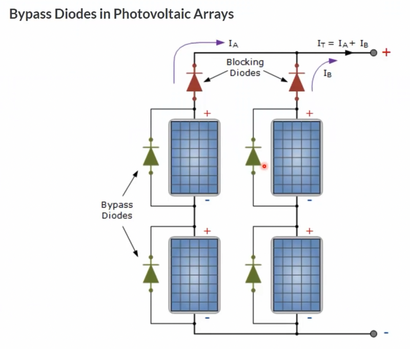

# Solar Arrays and Custom Installation

!!! info
    This guide was made as an accumulation of the video guides listed below:

    - [DIY Solar System vs Commercial Offer](https://youtu.be/VGDGO0U7l8s)
    - [Do It Yourself Solar Power? - Easy DIY Solar Panel Installation!](https://www.youtube.com/watch?v=jSa1tvrrFZg)

## Introduction
Recently, energy has become a more critical and therefore expensive resource. The ability to produce high-quality electrical energy is becoming increasingly important for countries, as so many people rely on this resource. Without it, accomplishing simple tasks, such as heating a room, keeping food cold, or communicating with others, become more tedious and inefficient. While many methods have been explored, renewable methods provide a way to produce electrical energy whilst having a minimal impact on the surrounding environment.

The most common and inexpensive renewable method for an individual to produce electrical energy is to use solar arrays. Adding a solar array to one's rooftop is becoming increasingly popular in an attempt to alleviate the additional costs that are brought on by energy companies year after year, and as their popularity grows, the more their price decreases. Solar arrays have also been shown to be capable of operating at 80% efficiency for 25-30 years, and still producing energy after that period.

In this guide we will go over the different methods for solar panel mounting and briefly go over the costs of installing such a system on the roof of a private household.

## Solar Array System
A general solar array system is composed of two or three components:

- Solar Array
- Inverter
- Battery (optional for a grid-connected system)

This setup can then be connected to the grid, or remain as an off-grid system. A simple representation of such a system is shown below:

With a grid-connected system, it is possible to provide extra power back into the grid, therefore 'selling' your power back to the electrical company for a price. Depending on the installed solar array and your location, it is possible to receive more that 1'000 CHF per year with a grid-connected system.

An off-grid system is not connected to the power-grid (as its name suggests), thus making the battery required to store any collected energy.

### Installation Possibilities
As solar arrays are becoming more common, many different installation methods are becoming available on the market. It is even possible to buy a kit and mount them yourself. We will also go over how a DIY setup compares with the more common methods for installation.

## Method for Roof Installation
It is obviously preferable to avoid large modifications to the building when installing solar arrays, as such installations can increase costs drastically, as well as delay the entire process. It is also important to use proper materials that will survive different weather conditions that they are subjected to over the lifespan of the array.

A newer method from a company [K2 Systems](https://legacy.k2-systems.com/en/products) uses simple weights placed onto aluminium extrusions. This makes the installation easy, as no holes need to be drilled into the roof, and reliable, as the aliminium extrusions are well suited to extreme weather conditions. The solar array are therefore laid onto the roof, making it easy to replace or change the arrangement if needed in the future.

## Solar Panel Mounting Optimization
There are two common mounting options when mounting panels onto your roof. The first is south-facing panel (for those who live in the northern hemisphere), and the second is east-west facing panels. It is important to know which arrangement is being recommended, as this will greatly influence the ability for the system to produce maximum power. Let's look at a side-view of both systems:

We can see in the figure above, that the south orienting panels have gaps in between the panels, as shade is created by the panel in front. In the east-west configuration, the only gap between the panels is to allow for maintenance space.

There is an online calculator tool provided by the European Commission where you can calculate the optimal exposure to the sun: <https://re.jrc.ec.europa.eu/pvg_tools/en/tools.html>

You can input your location in Europe and it can optimize the slope and azimuth angle of the panels for you. In previous years, with high-priced panels, the south-facing configuration was preferred to save on cost of the panels, but as solar panels have decreased in price, *optimizing for the roof performance is preferable tha optimizing for panel performance*.

Then why is the south-facing configuration still offered as an option? This is most likely due to the seeling price vs. the buying price of energy that is established by the electrical company. For optimum payback, it is therefore better to have a smaller panel area.

One can also optimize when the energy is returned to the grid, as buying electricity during the day is more expensive that buying electrical energy at night. However to implement this, a battery becomes a requirement.

## Inverter & Battery

The current output of solar panels is DC (direct current), an inverter is required to transform the direct current (DC) to alternating current (AC). This alternating current must be in phase and at the same frequency as the grid frequency if the inverter is connected to the grid.

To construct an off-grid system any inverter can be used, however for a grid-connected system, the inverter needs to be approved by the electricity company.

### Tasks of the Inverter
The inverter has a large number of tasks to accomplish, they are listed below: 

- Synchronize its frequency and phase before joining the grid network
- Manage the current inserted into the network according to the sun
- Battery management
- Switch to an off-grid scenario during a power outage
- Switch back if power comes on after a power outage
- Provide system information to home automation system

This is why it is important to buy a high quality inverter from a reputable brand. It is also important that the inverter incorporates several EMi and current filters, as performing such tasks incorrectly can lead to a lot of radio interference and inconsistent output.

!!! warning
    Pay attention when you select your inverter! Not all provide off-grid functionality. Most of them provide this functionality only for one phase!

## Panel Installation and Power Routing

In a common installation, the panels next to each other are connected in series and therefore have to carry the same current. But happens if one of these panels is put into shade by a chimney, or other object? With the panels connected in series, even if one panel gives less current, it will affect all of the other panels connected to it in series.

### Bypass Diodes
One common solution to such a problem is to use bypass diodes, that allow the current to pass in such a situation (see figure below). With this setup, the panel in the shade will not provide energy, but will not prohibit the current from the other panels in the string.

### Optimizers
Another newer solution is to use DC-DC converters, known as "optimizers". These converters are attached to each solar panel, and align the current of each panel to the string current by reducing the voltage. This way, the performance of a shaded panel can used to its maximum potential.

This at first sounds like a good solution, however there are common caveats with optimizers that are important to note:

- They have to operate in a hot environment (directly below the panels), so their life-span is short
- If an optimizer is installed for each panel, the risk of an early death due to manufacturing errors increases
- Given their location, optimizers might not be easy to replace depending on the installation situation on the roof
- If they are made cheaply, they can create a lot of radio interference

### Micro-Inverters
The final explored solution is to use micro-inverters. As was mentioned previously, we would normally need a large inverter to handle a variety of tasks. The most important task of an inverter is to convert the high DC voltage to a reasonable AC voltage for daily use (240 VAC).

However it is becoming more popular to divide this task up throughout many smaller inverters located in proximity to the panel. This way, AC current is generated on the roof, and even when a group of panels is in the shade, no energy is lost in the system. Furthermore, as good quality inverters can have a very long lifetime, a lot of the caveats found with optimizers do not apply to micro-inverters.

### Battery
As we saw before, the battery for such a system is optional depending on what kind of system you want to install. While a battery can be made use of during a power outage, it is worth factoring into the cost calculation as batteries are becoming more expensive.

Certain types of batteries are also known to be a fire hazard. Depending on their chemistry, it can be extremely difficult to put out a fire created by some batteries. A good battery chemistry to use to avoid such a risk would be a $\text{LiFePo}_4$ battery.
